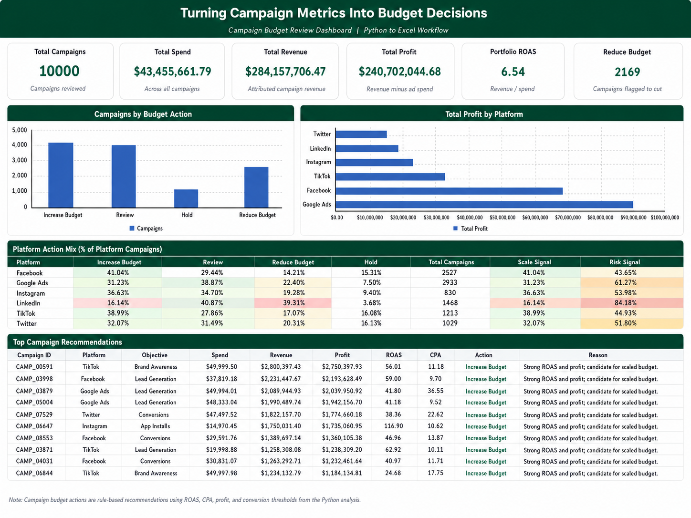
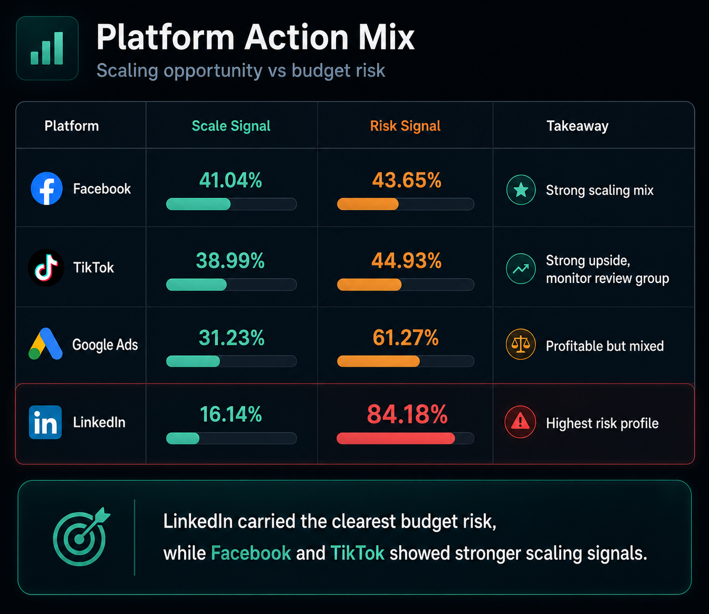
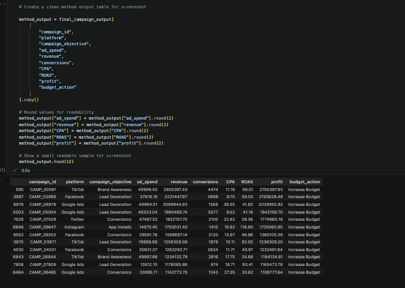

# Turning Campaign Metrics Into Budget Decisions

A Python to Excel campaign budget review workflow that classifies digital advertising campaigns into increase, reduce, hold, or review actions based on ROAS, CPA, profit, and conversions.

*Campaign budget review dashboard showing how Python-generated budget actions were translated into a stakeholder-facing Excel output.*

---

## Business Question

Which campaigns should receive more budget, less budget, or further review based on spend efficiency and conversion quality?

## Why It Matters

Marketing spend is not automatically effective just because a campaign has traffic, conversions, or revenue. A business needs to know whether budget is going into campaigns that produce efficient returns, or whether spend is being wasted on campaigns with weak ROAS, high CPA, or poor profit outcomes. This analysis matters because it turns campaign performance data into a clearer budget review decision.

## Dataset

This project uses a public digital advertising campaign performance dataset with 10,000 campaign records. The dataset includes campaign platforms, objectives, placements, devices, spend, revenue, conversions, CPA, ROAS, and profit. It was used to simulate a marketing budget review workflow rather than real company media buying optimization.

## Tools Used

- Python
- pandas
- numpy
- Jupyter Notebook
- Excel

## Analytical Approach

The analysis started with validation checks for missing values, duplicate campaign IDs, and core field consistency. A focused campaign performance table was created using spend, revenue, conversions, CPA, ROAS, profit, and campaign context fields. The key analytical decision was to use explainable rule-based thresholds rather than a predictive model, because the output needed to support stakeholder review. Median benchmarks for ROAS, CPA, conversion rate, and profit were used to classify campaigns into Increase Budget, Reduce Budget, Review, or Hold. The processed outputs were then exported into Excel to create a dashboard with KPI cards, budget action summaries, platform comparisons, and campaign-level recommendations.

## Key Findings

- 3,297 Increase Budget campaigns generated $209.68M total profit with 17.77 average ROAS, making this the clearest scaling group.
- 2,169 Reduce Budget campaigns produced -$3.75M total profit with only 0.43 average ROAS, showing clear budget risk.
- 3,434 Review campaigns carried $16.73M total spend with 2.88 average ROAS, showing that many campaigns needed further inspection rather than automatic scaling or cutting.
- Facebook had the strongest scaling mix, with 41.04% of campaigns classified as Increase Budget.
- LinkedIn carried the clearest risk signal, with 39.31% of campaigns classified as Reduce Budget and 40.87% classified as Review.

## Business Interpretation

The platform view showed why budget decisions should not be made from total profit alone. Google Ads produced the highest total platform profit, but its action mix still included 38.87% Review and 22.40% Reduce Budget campaigns. Facebook and TikTok showed stronger scaling profiles, while LinkedIn carried the clearest budget risk. The main business value is the separation between campaigns that are ready to scale and campaigns that need control, review, or reduction.

## Visual Preview

*Platform action mix showing that Facebook and TikTok had stronger scaling signals, while LinkedIn carried the clearest risk profile.*

*Python output showing the campaign-level recommendation table created before the Excel dashboard layer.*

## Limitations

This project uses a public campaign performance dataset, so the results should be read as a budget review workflow rather than real company media buying advice. The recommendation logic is rule-based and explainable, not predictive, which makes it suitable for stakeholder review but not a final automated budget optimization system.
